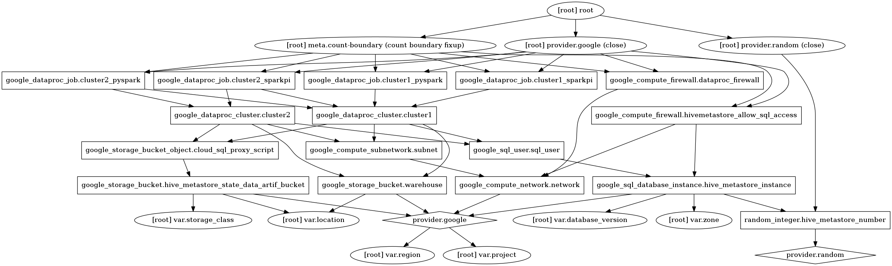

This project demonstrates how to use Terraform to create multiple dataproc clusters that use the same, shared, hivemetastore. It is essentially a demonstration of how to use Terraform to achieve the same as what is being demonstrated at [Using Apache Hive on Cloud Dataproc](https://cloud.google.com/solutions/using-apache-hive-on-cloud-dataproc#creating_the_warehouse_bucket) using `gcloud`.

Ensure you have enabled the relevant APIs:
* [Google Dataproc API](https://console.developers.google.com/apis/library/dataproc.googleapis.com)
* [Google SQL Admin API](https://console.developers.google.com/apis/library/sqladmin.googleapis.com)

by issuing `gcloud services enable dataproc.googleapis.com sqladmin.googleapis.com`


--- 

The project can be deployed by issuing

```bash
gcloud init #choose the project that you will be deploying to
gcloud services enable dataproc.googleapis.com sqladmin.googleapis.com
gsutil mb gs://${GCP_PROJECT}-tf-state #terraform state bucket used as the back-end for the Google provider
export GCP_PROJECT=$(gcloud config get-value project)
make init apply
```

and destroy using
```bash
make destroy
```

--- 

To generate the a graph displaying all the resources in this terraform project run

```bash
docker build -t graphwiz . &&
   terraform graph -type=plan > graph.dot &&
   docker run -v $(PWD):/tmp graphwiz dot /tmp/graph.dot -Tpng -o /tmp/graph.png &&
   rm graph.dot
```

Here is the latest committed state of that graph:

